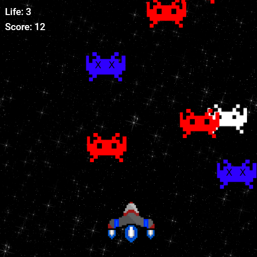

# Navinha Vanilla JS

Shump up game developed with vanilla js, no libraries.

<div align="center">
  <figure>
    
    <a target="_blank" src="https://titanguy99.github.io/naivinhajs/">Play it here</a>
  </figure> 
</div>

***Instructions:***

```
To run it locally, just open index.html
```
